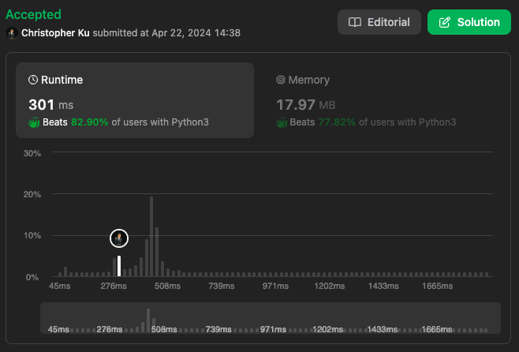

# 752. Open the Lock
***Topics***: *Breadth First Search*  
***Difficulty***: <span style="color: #fac31d;">Medium</span>
<!-- green: #46c6c2, yellow: #fac31d, red: #f8615c-->
---
You have a lock in front of you with 4 circular wheels. Each wheel has 10 slots: `'0', '1', '2', '3', '4', '5', '6', '7', '8', '9'`. The wheels can rotate freely and wrap around: for example we can turn `'9'` to be `'0'`, or `'0'` to be `'9'`. Each move consists of turning one wheel one slot.

The lock initially starts at `'0000'`, a string representing the state of the 4 wheels.

You are given a list of `deadends` dead ends, meaning if the lock displays any of these codes, the wheels of the lock will stop turning and you will be unable to open it.

Given a `target` representing the value of the wheels that will unlock the lock, return the minimum total number of turns required to open the lock, or -1 if it is impossible.

---
**Example 1:**  

Input: `deadends = ["0201","0101","0102","1212","2002"], target = "0202"`  
Output: `6`  
Explanation: `A sequence of valid moves would be "0000" -> "1000" -> "1100" -> "1200" -> "1201" -> "1202" -> "0202".
Note that a sequence like "0000" -> "0001" -> "0002" -> "0102" -> "0202" would be invalid,
because the wheels of the lock become stuck after the display becomes the dead end "0102".`

**Example 2:**  

Input: `deadends = ["8888"], target = "0009"`  
Output: `1`  
Explanation: `We can turn the last wheel in reverse to move from "0000" -> "0009".` 

**Example 2:**  

Input: `deadends = ["8887","8889","8878","8898","8788","8988","7888","9888"], target = "8888"`  
Output: `-1`  
Explanation: `We cannot reach the target without getting stuck.` 

---
## Intuition
We need to somehow enumerate all possible lock combinations from our current lock combination. With this transition of states we could either use recursion, DP or Breadth First Search / Depth First Search. 

A recursive solution would but to inefficient in terms of runtime and DP would be complex. Therefore we can consider using Breadth First Search for this problem. We can envision each lock combination as a possible **node** within the graph, and all `deadends` as an **isolated vertex**.


---
## Implementation
[implementation]

---
## Solution
```python
from collections import deque
def openLock(self, deadends: List[str], target: str) -> int:
    # Breadth First Search
    # For each combination we end up with keep track of ~
    # the total number of moves taken to get to the current combination
    # An adjacency map of possible lock transitions
    adj = {
        '0': ['1', '9'],
        '1': ['2', '0'],
        '2': ['3', '1'],
        '3': ['4', '2'],
        '4': ['5', '3'],
        '5': ['6', '4'],
        '6': ['7', '5'],
        '7': ['8', '6'],
        '8': ['9', '7'],
        '9': ['0', '8']
    }
    min_moves = inf
    v = set()
    q = deque()
    v.add('0000')
    q.append(('0000', 0))
    while q:
        cur, mv = q.popleft()
        # If current combination is in deadend we skip
        if cur not in deadends:
            if cur == target: 
                # If current combination is the same as target we update minimal moves
                min_moves = min(min_moves, mv)
            # Consider all combinations possible from current lock
            for i, lock in enumerate(cur):
                # Turning current lock left (increase)
                # Turning current lock right (decrease)
                left, right = adj[lock]
                new_left, new_right = cur[:i] + left + cur[i+1:], cur[:i] + right + cur[i+1:]
                # If the new combination in turning left isn't in visited locks add to queue
                if new_left not in v:
                    q.append((new_left, mv + 1))
                    v.add(new_left)
                # If the new combination in turning right isn't in visited locks add to queue
                if new_right not in v:
                    q.append((new_right, mv + 1))
                    v.add(new_right)
    return min_moves if min_moves != inf else -1
```
---
## Runtime & Space Complexity
$N$ ~ being the size of `deadends`.  

Runtime Complexity:  
$\mathcal{O}()$

[explanation]

Space Complexity:  
$\mathcal{O}()$

[explanation]

---
## Code Performance


---