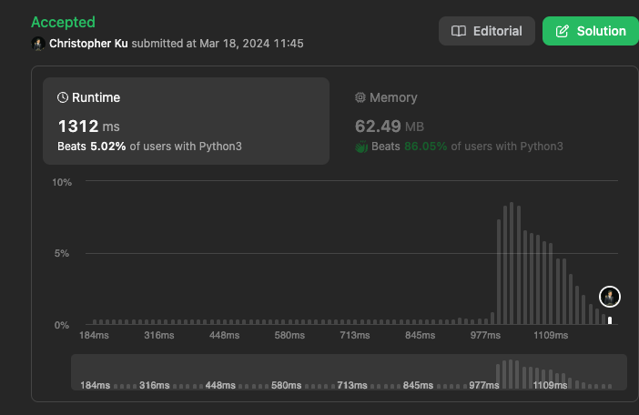

# 452. Minimum Number of Arrows to Burst Balloons
***Topics***: *Heap, Greedy, Array*  
***Difficulty***: <span style="color: #fac31d;">Medium</span>
<!-- green: #46c6c2, yellow: #fac31d, red: #f8615c-->
---
There are some spherical balloons taped onto a flat wall that represents the XY-plane. The balloons are represented as a 2D integer array `points` where `points[i] = [x_start, x_end]` denotes a balloon whose horizontal diameter stretches between `x_start` and `x_end`. You do not know the exact y-coordinates of the balloons.

Arrows can be shot up directly vertically (in the positive y-direction) from different points along the x-axis. A balloon with `x_start` and `x_end` is burst by an arrow shot at x if `x_start <= x <= x_end`. There is no limit to the number of arrows that can be shot. A shot arrow keeps traveling up infinitely, bursting any balloons in its path.

Given the array `points`, return the minimum number of arrows that must be shot to burst all balloons.

---
**Example 1:**  
Input: `points = [[10,16],[2,8],[1,6],[7,12]]`  
Output: `2`  
Explanation: 
```
The balloons can be burst by 2 arrows:
- Shoot an arrow at x = 6, bursting the balloons [2,8] and [1,6].
- Shoot an arrow at x = 11, bursting the balloons [10,16] and [7,12].
```  

**Example 2:**  
Input: `points = [[1,2],[3,4],[5,6],[7,8]]`  
Output: `4`  
Explanation: `One arrow needs to be shot for each balloon for a total of 4 arrows.`

**Example 3:**  
Input: `points = [[1,2],[2,3],[3,4],[4,5]]`  
Output: `2`  
Explanation: 
```
The balloons can be burst by 2 arrows:
- Shoot an arrow at x = 2, bursting the balloons [1,2] and [2,3].
- Shoot an arrow at x = 4, bursting the balloons [3,4] and [4,5].
```  

---
## Intuition
[intuition]

---
## Implementation
[implementation]

---
## Solution
```python
import heapq
def findMinArrowShots(self, points: List[List[int]]) -> int:
    # Given a number of intervals with [x_start, x_end]
    # At each point along x_min to x_max: what are the points that intersects the most intervals
    points = [[point[1], point[0]] for point in points]
    heapq.heapify(points)
    shots = []
    while points:
        x_end, x_start = heapq.heappop(points)
        if not shots or shots[-1][1] < x_start:
            shots.append([x_start, x_end])
    return len(shots)
```
---
## Runtime & Space Complexity
$[parameter]$ ~ being in `[parameter]`.  

Runtime Complexity:  
$\mathcal{O}(N \cdot log(N))$

[explanation]

Space Complexity:  
$\mathcal{O}(N)$

[explanation]

---
## Code Performance


---