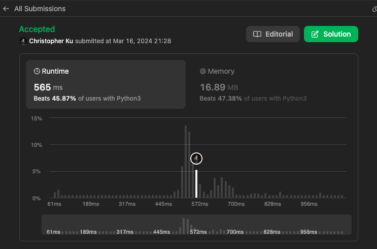

# 673. Number of Longest Increasing Subsequence
***Topics***: *Dynammic Programming*, *Array*   
***Difficulty***: <span style="color: #fac31d;">Medium</span>
<!-- green: #46c6c2, yellow: #fac31d, red: #f8615c-->
---
Given an integer array `nums`, return the number of longest increasing subsequences.

Notice that the sequence has to be **strictly** increasing.

---
**Example 1:**  

Input: `nums = [1,3,5,4,7]`  
Output: `2`  
Explanation: `The two longest increasing subsequences are [1, 3, 4, 7] and [1, 3, 5, 7].`  

**Example 2:**  

Input: `nums = [2,2,2,2,2]`  
Output: `5`  
Explanation: `The length of the longest increasing subsequence is 1, and there are 5 increasing subsequences of length 1, so output 5.`  

---
## Intuition
This problem involves dynamic programming because of the overlapping subproblem that at every index `i` we need to compute the `cnt[j]` of the longest subsequence in the range of $0 \leq j \leq i - 1$, and we would also need to what is the longest length subsequence up until that point in `dp[j]`. With these 2 important facts in mind we could compute the counts of every longest increasing subsequence at each point in the given array `nums`. In addition we have the optimal substructure that at each index `i` we would find the length of the longest subsequence at `i` with the longest subsequence possible from `dp[:i-1]` and the count for that length from the longest subsequence counts possible from `cnt[:i-1]`.

With this in mind we could effectively formulate the following state transition:
> **At i both dp and cnt:**
> 
> $$
> dp[i], cnt[i] =
> \begin{cases}
> (1 + dp[j], cnt[j]) & \text{if nums[i] > nums[j] and $dp[j] + 1 \gt dp[i]$ for $0 \leq j \lt i $}\\
> (dp[i], cnt[i] + cnt[j]) & \text{if nums[i] > nums[j] and $dp[j] + 1 = dp[i]$ for $0 \leq j \lt i $}
> \end{cases}
> $$

After we iterate over all of `nums` at each `i` we would have computed the length of longest possible subsequence that could be formed at `i` in `dp` and also the number of subsequences with length `dp[i]` in `cnt[i]` up until index `i`. So we this information we want to also know what is the final longest subsequence length. And with that information we could iterate over both `dp` and `cnt` if the longest subsequence we observed matches at `dp[i]` then we would add `cnt[i]` to our `ans` and return that result.

---
## Implementation
For the implementation we would initialize two arrays. `dp` with values of 1 because the minimal longest possible subsequence at `i` would be of length 1, and also `cnt` which is the number of longest subsequences with length `dp[i]` up until index `i`, also with initial values of 1.

Then we would iterate over `nums` using the state transition above and updating `dp[i]` and `cnt[i]` respectively according to the conditions. After each iteration we also want to keep track of what is the maximal subsequence length seen so far with `max_len = max(max_len, dp[i])`.

At the very end we would iterate over both `dp` and `cnt`. If the longest possible length at `dp` matches with the longest subsequence length seen. Then we would add `cnt[i]` to `ans`, which is the count of subsequence up until `i` that has the maximal length `max_len`. Lastly, we will return that result.

---
## Solution
```python
def findNumberOfLIS(self, nums: List[int]) -> int:
    """
    At i:
        - What is the number of longest increasing subsequences that we could make up to i?
    """
    dp = [1] * len(nums)
    cnt = [1] * len(nums)
    max_len = 1
    for i in range(1, len(nums)):
        for j in range(i):
            if nums[i] > nums[j]:
                if dp[j] + 1 == dp[i]:
                    cnt[i] += cnt[j]
                if dp[j] + 1 > dp[i]:
                    dp[i] = 1 + dp[j]
                    cnt[i] = cnt[j]
        max_len = max(max_len, dp[i])
    ans = 0
    for i in range(len(cnt)):
        if dp[i] == max_len:
            ans += cnt[i]
    return ans
```
---
## Runtime & Space Complexity
$N$ ~ being the size of the input array `nums`.  

Runtime Complexity:  
$\mathcal{O}(N^2)$  

This problem will have a polynomial runtime because at each iteration we will be doing $N-1, N-2, N-3$ computations and summing these computations up at each iteration until the N-th iteration would yield a dominant term of $N^2$.

Space Complexity:  
$\mathcal{O}(N)$  

The space complexity here will be linear because both `dp` and `cnt` will have at most $N$ elements.

---
## Code Performance


---