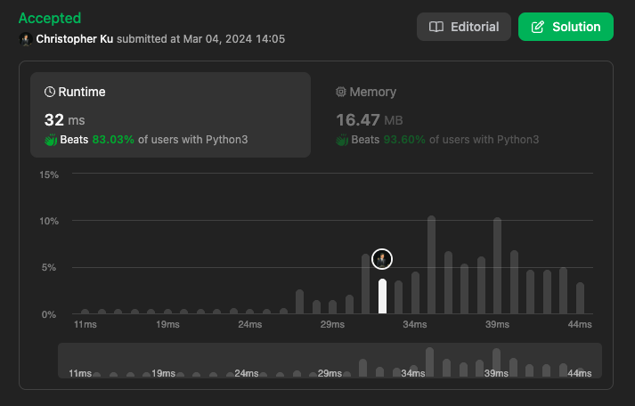

# 19. Remove Nth Node From End of List
***Topics***: *Linked List, Two Pointers*  
***Difficulty***: <span style="color: #fac31d;">Medium</span>
<!-- green: #46c6c2, yellow: #fac31d, red: #f8615c-->
---
Given the `head` of a linked list, remove the `n`-th node from the end of the list and return its head.

---
**Example 1:**  
  
Input: `head = [1,2,3,4,5], n = 2`  
Output: `[1,2,3,5]`  

**Example 2:**  
Input: `head = [1], n = 1`  
Output: `[]`  

**Example 3:**  
Input: `head = [1,2], n = 1`  
Output: `[1]`  


---
## Intuition
If we were to solve this problem in 2 passes it would be very easy. The approach would be on the first pass make not of the entire length of the linked list. Then in the second pass iterate to the node that is just before the `n`-th node from the end, which is the connection point to whatever is after the `n`-th node from the end to be deleted.

This is reminiscent of the fast and slow pointers approach however this time both pointers would advance forwards at the same rate. Between the pointer that is further ahead and behind that should maintain a fixed distance apart from eachother.

There is a specific reason for this, and it could be explained as follows.

>
>
> ---

---
## Implementation
[implementation]

---
## Solution
```python
def removeNthFromEnd(self, head: Optional[ListNode], n: int) -> Optional[ListNode]:
    # One pass solution:
    ans = ListNode(None, head)
    fast, slow = ans, ans
    # Preprocessing
    for _ in range(n):
        if fast.next:
            fast = fast.next
    while fast.next:
        slow = slow.next
        fast = fast.next
    if not slow:
        return None
    slow.next = slow.next.next
    return ans.next
```
---
## Runtime & Space Complexity
$N$ ~ being the size of the input linked list `head`.  

Runtime Complexity:  
$\mathcal{O}(N)$

[explanation]

Space Complexity:  
$\mathcal{O}(N)$

[explanation]

---
## Code Performance


---