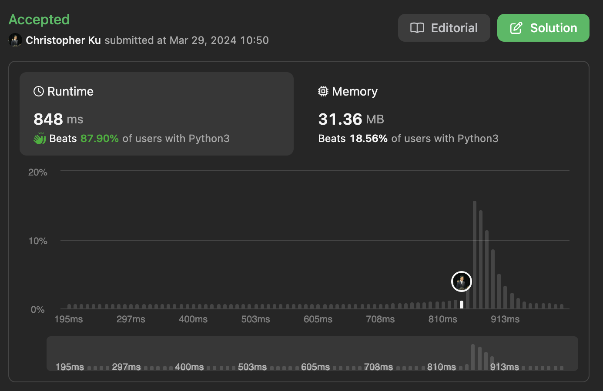

# 2962. Count Subarrays Where Max Element Appears at Least K Times
***Topics***: *Sliding Window, Array*  
***Difficulty***: <span style="color: #fac31d;">Medium</span>
<!-- green: #46c6c2, yellow: #fac31d, red: #f8615c-->
---
You are given an integer array `nums` and a positive integer `k`.

Return the number of subarrays where the maximum element of `nums` appears at least `k` times in that subarray.

A **subarray** is a contiguous sequence of elements within an array.

---
**Example 1:**  

Input: `nums = [1,3,2,3,3], k = 2`  
Output: `6`  
Explanation: `The subarrays that contain the element 3 at least 2 times are: [1,3,2,3], [1,3,2,3,3], [3,2,3], [3,2,3,3], [2,3,3] and [3,3].`  

---
## Intuition
For this problem we can use a sliding window approach, because we are once again dealing with finding contiguous subarrays. However, we just need to decide on when to grow and shrink the window.

**Grow the window when**  
- The count of the max element in `nums` is strictly less than `k` in our current window starting from `[l, r]`

**Shrink the window when**  
- The count of the max element in `nums` is equal to `k` in our current window starting from `[l, r]`

The reason of why we shrink the window when it is equal to `k` may not be apparent from the beginning. This is because you would think that we would want to keep increasing the window even if there are already `k` occurrences of the max element in our current window. However, if we do this our implementation would be significantly different in the sense we would need to keep track of the earliest position and latest position of the max element to accurately count the number of subarrays within our current window `[l, r]` which satisfies the condition.

**Example:**  
For the window `[1,3,2,3]`, `l = 0`, `r = 3`
- We know that we could start from anywhere between 0 to 1 for `l` and end at 3 for `r` and these are the correct start and end positions for subarrays within the range that satisfies the condition. 
  
- However, we can't start from 2 as this only forms the subarray `[2,3]` which doesn't meet the condition.

So if we where to use a sliding window we want to always maintain the fact that in our current window `[l, r]` there are exactly `k - 1` occurrences of the max element. This ensures that our `l` pointer would point at the latest position where there are only `k - 1` elements in our current window, which means that for all subarrays ending at our current `r` there would be exactly `l` subarrays which satisfies the condition ending at `r` and beginning anywhere between `[0, l - 1]`.
```
   i:  0  1  2  3
nums: [1, 3, 2, 3]
       s  s  l--r
```
> ---
> - In the example above `l` is always pointing at the latest position where the window `[l, r]` has exactly `k - 1` occurrences of the max element
> - So for all valid subarrays ending at `r` meeting the condition they could start from any positions before `l`.
> - This is because we know that `l` in this case would always be pointing at one position after the latest position of max element seen for which there are exactly `k` occurrences in our `[l, r]` window before shrinking it.
> - Which is why there are exactly `l` subarrays which end at `r` that satisfies the condition, we could tally this result.
> - For the above example, we count the following subarrays:
>   - [1, 3, 2, 3]
>   - [3, 2, 3]
> ---


---
## Implementation
[implementation]

---
## Solution
```python
def countSubarrays(self, nums: List[int], k: int) -> int:
    # Sliding Window
    l = 0
    ans, cnt, idx = 0, 0, 0
    max_n = max(nums)
    for r in range(len(nums)):
        if nums[r] == max_n:
            cnt += 1
        while l <= r and cnt >= k:
            if nums[l] == max_n:
                cnt -= 1
            l += 1
        # At this point we know that the current window has exactly k - 1 max_n for nums[l:r]
        # So we know that for nums[:l-1] the window has k or more of max_n
        # This means that all subarrays from [0->l:r] has k or more of max_n
        ans += l
    return ans
```
---
## Runtime & Space Complexity
$N$ ~ being the size of input array `nums`.  

Runtime Complexity:  
$\mathcal{O}(N)$

[explanation]

Space Complexity:  
$\mathcal{O}(1)$

[explanation]

---
## Code Performance


---