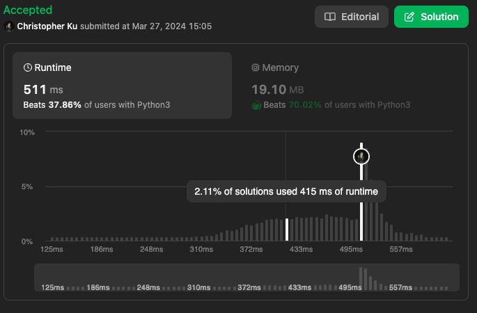

# 713. Subarray Product Less Than K
***Topics***: *Sliding Window, Array*  
***Difficulty***: <span style="color: #fac31d;">Medium</span>
<!-- green: #46c6c2, yellow: #fac31d, red: #f8615c-->
---
Given an array of integers `nums` and an integer `k`, return the number of contiguous subarrays where the product of all the elements in the subarray is strictly less than `k`.

---
**Example 1:**  

Input: `nums = [10,5,2,6], k = 100`  
Output: `8`  
Explanation: `The 8 subarrays that have product less than 100 are:
[10], [5], [2], [6], [10, 5], [5, 2], [2, 6], [5, 2, 6]
Note that [10, 5, 2] is not included as the product of 100 is not strictly less than k.`  

**Example 2:**  

Input: `nums = [1,2,3], k = 0`  
Output: `0`    

---
## Intuition
For this problem we could consider a sliding window approach because we are trying to find contiguous subarrays and with a sliding window we could capture essential pieces of information that meets the conditions for a certain contiguous chunk of the given `nums` array. 

For a sliding window problem we want to agree on when we should shrink our current window and grow our window.

We want keep on growing the window when:  
- The current window's total product is still less than `k`.

We want to keep shrinking the window when:
- The current window's total product is more than `k`.

Now we need to figure how we could count up all the possible subarrays at the current `end` index of our window if the total product of the current window from `start` to `end` is less than `k`.

After we exit the while loop of shrinking our window we know that at that point the current window from `left` to `right` will always have a total product less than `k`. With this in mind, we know that this allows us to enumerate all possible `start` and `end` indexes within `nums` that meets the given condition.

So at every `end` index we ask ourselves, how many subarrays that end at `end` and begin from any arbitrary position in $start \leq i \lt end$ would satisfy `product < k`. At `end` we know that the total number of arrays that satisfies this is `end - start`.

Take for instance our current window being at `end = 3` and `start = 0` with `k = 3`.  
For a window like: `[1, 1, 1, 3]`  
Subarrays with `product < k`:    
`[1, 1, 1, 3]`  
`[1, 1, 3]`  
`[1, 3]`  
`[3]`
And notice that the individual start positions for each one of these subarays are 0, 1, 2, 3 respectively. Which is just every start position from `start` up to and including `end`.


---
## Implementation
[implementation]

---
## Solution
```python
def numSubarrayProductLessThanK(self, nums: List[int], k: int) -> int:
    ans = 0
    start = 0
    product = 1
    for end in range(len(nums)):
        product *= nums[end]
        while start <= end and product >= k:
            product /= nums[start]
            start += 1
        ans += (end - start) + 1
    return ans
```
---
## Runtime & Space Complexity
$N$ ~ being the size of input array `nums`.  

Runtime Complexity:  
$\mathcal{O}(N)$

[explanation]

Space Complexity:  
$\mathcal{O}(1)$

[explanation]

---
## Code Performance


---