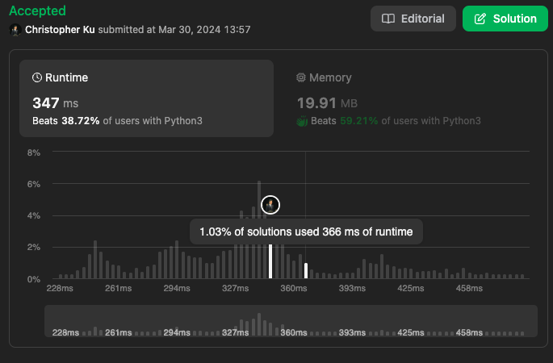

# 992. Subarrays with K Different Integers
***Topics***: *Sliding Window, Array*  
***Difficulty***: <span style="color: #f8615c;">Hard</span>
<!-- green: #46c6c2, yellow: #fac31d, red: #f8615c-->
---
Given an integer array `nums` and an integer `k`, return the number of good subarrays of `nums`.

A good array is an array where the number of different integers in that array is exactly `k`.

For example, `[1,2,3,1,2]` has `3` different integers: `1`, `2`, and `3`.
A subarray is a contiguous part of an array.

---
**Example 1:**  

Input: `nums = [1,2,1,2,3], k = 2`  
Output: `7`  
Explanation: `Subarrays formed with exactly 2 different integers: [1,2], [2,1], [1,2], [2,3], [1,2,1], [2,1,2], [1,2,1,2]`  

**Example 2:**  

Input: `nums = [1,2,1,3,4], k = 3`  
Output: `3`  
Explanation: `Subarrays formed with exactly 3 different integers: [1,2,1,3], [2,1,3], [1,3,4].`  

---
## Intuition
For this problem we could also consider a sliding window approach. This is because we are also trying to find contiguous chunks of an array that satisfies a given condition. And we could do this by keeping track of important information we have about our current window.

Let's consider the following scenarios:

1. If our current window already has exactly `k` different integers.  
$\rightarrow$ We could keep increasing our window to the right as long as new numbers are the same the numbers that are already in the current window

2. If our current window has less than `k` different integers
$\rightarrow$ We could keep increasing our window to the right until we accumulate `k` distinct integers in our current window.

3. If our current window has more than `k` different integers
$\leftarrow$ Decrease our window on the left until the number of distinct integers is less than or equal to `k`

However, when we only use this template the `start` and `end` position we end up with doesn't tell us how many subarrays has exactly
`k` distinct elements. Instead it tells us that for subarrays between `start` and `end` there for all subarrays start at any point between
`[start, end]` and ending at the current `end` in the `nums` array there are `(start - end) + 1` number of subarrays with
`k` or less distinct elements.

If we keep track of the relative position and distribution of elements within our window. Then we could probably come up with a way
of discerning the total number of subarrays that has exactly `k` distinct elements for our current window.

For the case mentioned above please take a look at the following example:  
When grow our window from `end = 1` to `end = 2` we know can't be sure to say that every subarray 
starting from an arbitrary `[start, end)` until `end` has **exactly** `k` distinct integers.
- `[2, 1, 1]`:  `{[2, 1, 1], [1, 1]}` `[1, 1]` isn't a subarray that has **exactly** `k` distinct integers.
  
In this case we need to figure out a way to effectively count all subarrays within that given range with has exactly `k` distinct integers.
We can't do this without saving information about the positions of elements within the current window.

So instead we could make take another logical approach and say that for a given window if the current window's number of 
subarrays represents the total subarrays that has at most `k` distinct elements `exact`. Let's we also count the total number of
subarrays within the given window that has at most `k - 1` distinct elements `less`.

Then we could say for sure that our current window will have exactly `exact - less` subarrays with exactly `k` distinct elements.
This is because `exact` counts includes subarrays with `k, k - 1, k - 2, ...` distinct elements. `less` would only count
subarrays with `k - 1, k - 2, ...`. So therefore the `counts(k, k - 1, k - 2, ..., 1) - counts(k - 1, k - 2, ..., 1) = counts(k)`.


---
## Implementation
For our implementation we could intalize a `freq` hashmap to keep track of the total number of distinct integers
within our current window, which also at the same time keeps track of the counts of each distinct number within our current
window.

`start` to point to the beginning of our window
`exact` which represents the number of subarrays which has at most `k` distinct elements
`less` which represents the number of subarrays which has at most `k - 1` distinct elements

Then use a for loop to expand our window incrementing the `end` pointer and shrinking the window when necessary
with a while loop within the for loop to get both `start` and `exact`.

At the very end return `exact - less` ~ `subarraysAtMostKDistinct(k) - subarraysAtMostKDistinct(k - 1)`

---
## Solution
```python
def subarraysWithKDistinct(self, nums: List[int], k: int) -> int:
    # Sliding window
    # Find the number of subarrays that has at most k distinct elements
    # Find the number of subarrays that has at most k - 1 distinct elements
    start = 0
    exact, less = 0, 0
    freq = {}
    for end in range(len(nums)):
        if nums[end] not in freq:
            freq[nums[end]] = 1
        else:
            freq[nums[end]] += 1
        while start <= end and len(freq) > k:
            freq[nums[start]] -= 1
            if not freq[nums[start]]:
                del freq[nums[start]]
            start += 1
        exact += (end - start) + 1
        
    start = 0
    freq = {}
    for end in range(len(nums)):
        if nums[end] not in freq:
            freq[nums[end]] = 1
        else:
            freq[nums[end]] += 1
        while start <= end and len(freq) > (k - 1):
            freq[nums[start]] -= 1
            if not freq[nums[start]]:
                del freq[nums[start]]
            start += 1
        less += (end - start) + 1

    return exact - less
```
---
## Runtime & Space Complexity
$N$ ~ being the size of input array `nums`.  
$k$ ~ being the value of `k`.  

Runtime Complexity:  
$\mathcal{O}(N)$

Runtime is linear because both our for loops iterate over elements of `nums` in the worse case $N$ times
and also our while loop would iterate over $N$ `nums[end]` elements in the worse case for both.

Space Complexity:  
$\mathcal{O}(k)$

For both our sliding windows we would need to keep track of at most `k` distinct numbers in our windows.

---
## Code Performance


---