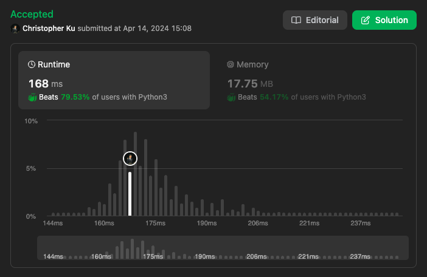

# 255. Verify Preorder Sequence in Binary Search Tree
***Topics***: *Stack, Monotonic Stack*  
***Difficulty***: <span style="color: #fac31d;">Medium</span>
<!-- green: #46c6c2, yellow: #fac31d, red: #f8615c-->
---
Given an array of unique integers `preorder`, return `true` if it is the correct preorder traversal sequence of a binary search tree.

---
**Example 1:**  


Input: `preorder = [5,2,1,3,6]`  
Output: `true`  

**Example 2:**  

Input: `preorder = [5,2,6,1,3]`  
Output: `false`  

---
## Intuition
This question is quite hard to explain with words, it is best for me to illustrate the thought process for this question. The implementation is very simple but the logic behind this problem is more complex.

Firstly, let us look at the BST invariant:
For a `node`:
- All values in `node.left` is smaller than `node.val`
- All values in `node.right` is greater than `node.val`

Since preorder traversal handles the node first before its children, this makes traversing the tree a lot easier with the use of a stack.

We can consider the following scenarios where we traverse down the left subtrees of each node:

- If we are given `preorder = [5, 3, 2, 1, 3]`. The first value `5` must be the root, this is because we using a preorder traversal. Afterwards we can compare `5` with the next value in the list which is `2`. Since `2 < 5` this means that `2` must be in the left subtree of node `5` to uphold the BST invariant. We do the same for node `1` until we reach `3`.
  
- At this point `3` cannot be to left of node `1` this is because `3 > 1`. In a preorder traversal we visit the node, visit left and lastly visit right. So in a preorder traversal this node would exist as the right child of node `2` which is the parent of node `1`, which makes sense because the childs of the most recent parent node would be processed first.
  

- When we traverse perform a preorder DFS traversal on a BST, it will continuously walk left until it can't. This means that for a preorder traversal as long as we see decreasing values we can keep on walking left.

  

- However if we are instead given the sequence `preorder = [12, 8, 5, 1, 10]` a problem arises for us. Where are we meant to insert `10`? In this case we need to find a parent node `x` down in the monotonically decreasing stack that is the greatest value possible less than `10`.

 

  
- As seen here `8` would be the correct node for us to walk right.

From our observations so far we can establish 2 things:
- A stack can be used to emulate walking left, walking right, and moving up (backtracking)
- The stack must be in monotonically decreasing order to maintain the fact that all left childs of parent nodes before down in the stack is visited, and the left childs of each node must be less than its parent.
- The node at the top of the stack is the current node that we are at in our current DFS traversal.
  
However, if we are given `preorder = [5, 2, 6, 1, 3]` we are in trouble because once we reach `1` after popping both `2` and `5` from the stack we would append it to the top of stack after `6` as usual, but this is doesn't represent a correct BST in this case because of the following explanation.


With this final observation we can say that when we pop from the stack it means we are done visiting (the current node which is at the top of the stack)'s left child so every node from here on out must be at least larger than the current node, because we are walking right from the current node.

We can do this by also keeping track of the minimal value `min_limit` that all of our current nodes in the traversal must be larger by. If at any point during our traversal we encounter a value that is less than or equal to `min_limit` then we would return `False`.

---
## Implementation

1. Declare an integer `min_limit` to a small value like negative infinity, and a `stack`.
2. Iterate over `preorder`. For each `num`:  
   - Clean the `stack`. While the top of the `stack` is less than `num`, pop from it and update `min_limit`.
   - If `num <= minLimit`, return `False`.
   - Push `num` onto the `stack`.
3. Return `True` if we get through the whole input.

---
## Solution
```python
from collections import deque
def verifyPreorder(self, preorder: List[int]) -> bool:
    min_limit = -inf
    stack = deque()
    # Maintain a monotonically decreasing stack
    # The stack represents everything that is to the left hand side of the tree
    # When we append to stack we are visitng the (left child) of the node on top of the stack
    # When we pop from the stack we have finished visiting the left subtree of the popped node
    # As soon as we find a node with value that is larger

    for num in preorder:
        while stack and num > stack[-1]:
            min_limit = stack.pop()
        if num <= min_limit:
            return False
        stack.append(num)
    return True
```
---
## Runtime & Space Complexity
$N$ ~ being the size of input array `preorder`.  

Runtime Complexity:  
$\mathcal{O}(N)$

Given a `preorder` of at most $N$ elements we would iterate over at most $N$ elements.

Space Complexity:  
$\mathcal{O}(N)$

Our `stack` would have at most $N$ elements if `preorder` is in decreasing order for an unbalanced BST.

---
## Code Performance


---