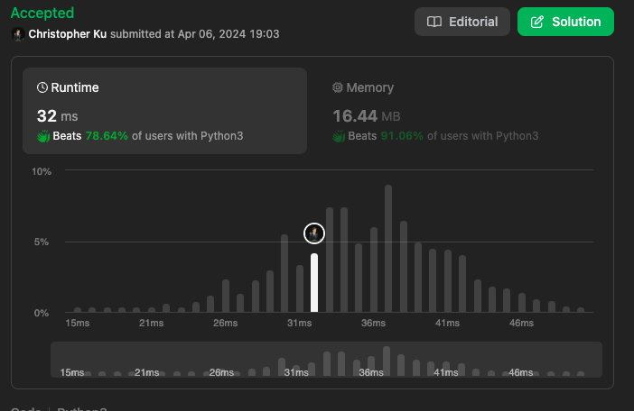

# 678. Valid Parenthesis String
***Topics***: *Stack, Greedy*  
***Difficulty***: <span style="color: #fac31d;">Medium</span>
<!-- green: #46c6c2, yellow: #fac31d, red: #f8615c-->
---
Given a string `s` containing only three types of characters: `'('`, `')'` and `'*'`, return `true` if `s` is **valid**.

The following rules define a valid string:

- Any left parenthesis `'('` must have a corresponding right parenthesis `')'`.
- Any right parenthesis `')'` must have a corresponding left parenthesis `'('`.
- Left parenthesis `'('` must go before the corresponding right parenthesis `')'`.
- `'*'` could be treated as a single right parenthesis `')'` or a single left parenthesis `'('` or an empty string `""`.


---
**Example 1:**  

Input: `()`  
Output: `true`  

**Example 2:**  

Input: `(*)`  
Output: `true`

**Example 3:**  

Input: `(*))`  
Output: `true`

---
## Intuition
The difficulty in this problem lies in the addition of using `'*'`. And they function as some sort of wildcard in this case. As they could be either a closed or open bracket or an empty string.

Since the problem comes down to successfully matching all open brackets with close brackets, we could try and keep track of open brackets. However, we want to do this in exhaustive manner with a greedy approach to the problem.

Greedy Approach:
- Keep `'*'` for as long as possible
- Exhaust available open brackets first when close brackets are encountered
- Exhaust available asterisks when we don't have open brackets once we encounter close brackets

In doing so, at the very end we would end up with the optimal number and positions of both asterisks and open brackets within our string, after matching every close bracket that we encounter.

After this step we are left with 2 possible scenarios
- There are still open brackets left that aren't exhausted by closed bracket
- All open brackets are exhausted already -> That means the given string is valid

As we append open brackets and asterisks in their stack we should also keep track of their index. This is the part where it comes in handy.

If there are still open brackets this means that we need to exhaust all of these open brackets with asterisks that comes later than each of the open brackets. This is because we don't have any more close brackets to match them up with. If for an open bracket the corresponding latest asterisk appears before it's index this means that the string is invalid, because we can't match that open bracket with anything left in the string after the first pass.


---
## Implementation
Initiate stacks for `open_b` and asterisks `ast`. Afterwards we can iterate through the string `s` with a for loop. For each string `s[i]` we can use the processing and logic we described above in the intuition to add or remove them from their respective stacks.

After the first pass with the for loop if there are still open brackets then we would need to process them accordingly with our available `ast`

If at the very end we still have open brackets return `False` else return `True`

---
## Solution
```python
def checkValidString(self, s: str) -> bool:
    # When would we use up an asteriks?
    # Keep the asteriks for as long as possible
    # Using 2 stacks
    open_b = []
    ast = []
    for i in range(len(s)):
        cur = s[i]
        if cur == '(':
            open_b.append((cur, i))
        elif cur == ')':
            if open_b:
                open_b.pop()
            else:
                if not ast:
                    return False
                else:
                    ast.pop()
        else:
            ast.append((cur, i))
    while open_b and ast:
        if open_b[-1][-1] > ast[-1][-1]:
            return False
        open_b.pop()
        ast.pop()
    return False if open_b else True
```
---
## Runtime & Space Complexity
$N$ ~ being the size of input string `s`.  

Runtime Complexity:  
$\mathcal{O}(N)$

Linear runtime because we are only appending or removing each element of `s[i]` from the stack at most once.

Space Complexity:  
$\mathcal{O}(N)$

Linear because we are using 2 stacks to keep track of `open_b` and `ast`.

---
## Code Performance


---