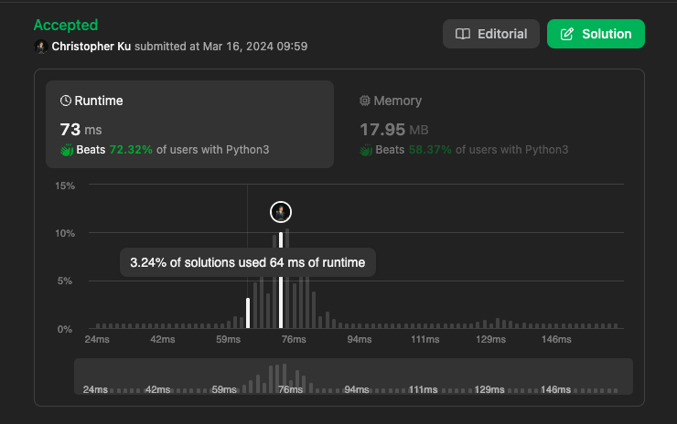

# 26. Remove Duplicates from Sorted Array
***Topics***: *Two Pointers, Array*  
***Difficulty***: <span style="color: #46c6c2;">Easy</span>
<!-- green: #46c6c2, yellow: #fac31d, red: #f8615c-->
---
Given an integer array `nums` sorted in non-decreasing order, remove the duplicates in-place such that each unique element appears only once. The relative order of the elements should be kept the same. Then return the number of unique elements in `nums`.

Consider the number of unique elements of `nums` to be `k`, to get accepted, you need to do the following things:

- Change the array `nums` such that the first `k` elements of `nums` contain the unique elements in the order they were present in `nums` initially. The remaining elements of `nums` are not important as well as the size of `nums`.  
- Return `k`.

---
**Example 1:**  
Input: `nums =[1,1,2]`  
Output: `2, nums = [1,2,_]`  
Explanation: `Your function should return k = 2, with the first two elements of nums being 1 and 2 respectively. It does not matter what you leave beyond the returned k (hence they are underscores).`  

**Example 2:**  
Input: `nums = [0,0,1,1,1,2,2,3,3,4]`  
Output: `5, nums = [0,1,2,3,4,_,_,_,_,_]`  
Explanation: `Your function should return k = 5, with the first five elements of nums being 0, 1, 2, 3, and 4 respectively. It does not matter what you leave beyond the returned k (hence they are underscores).`


---
## Intuition
Since the given array `nums` is already sorted we can be sure that duplicate numbers would be directly next to each other within the array. For this problem we could use a 2 pointers approach. We can initialize a `target_ptr` which iterates through each index of `nums` by one each time for the current `sample_ptr` number that we see. The `sample_ptr` would basically iterate through `nums` until it sees a number that is not the same as the number at the `target_ptr` position.

If the `sample_ptr` gets to a position where it sees a number that is different from the `target_ptr` number. This means that we have iterated pass all numbers that is the same as the `sample_ptr` within `nums`. So we could increment the `target_ptr` position by one and do a swap for `nums[sample_ptr]` and `nums[target_ptr]`. This way we could always make sure the first `k` elements of the `nums` array is distinct.

After doing this if our `sample_ptr` is still within bounds of our `nums` array then we could repeat the process above with the new `target_ptr` number and sample every number that exists in `nums` for the new `target_ptr` number with the `sample_ptr.`

---
## Implementation
We would initialize 2 pointers `target_ptr` and `sample_ptr` as we mentioned above. With 2 nested while loops we would make sure the `sample_ptr` is always in bounds of the `nums` array and sample every element like we mentioned within our intuition.

Lastly, since we want to return the total number of distinct elements present within `nums` we would return `target_ptr + 1` as our final answer once our algorithm finishes.

**Extremes and Edge cases:**
- There is a scenario where the `sample_ptr` in the inner while loop could exceed the length of `nums` at that point. We wouldn't want to keep on sampling and execute the inner while loop. This could happen if the array only has homogenous elements.

---
## Solution
```python
def removeDuplicates(self, nums: List[int]) -> int:
    target_ptr, sample_ptr = 0, 1
    while sample_ptr < len(nums):
        while sample_ptr < len(nums) and nums[target_ptr] == nums[sample_ptr]:
            sample_ptr += 1
        if sample_ptr < len(nums):
            if nums[target_ptr] != nums[sample_ptr]:
                target_ptr += 1
                nums[target_ptr] = nums[sample_ptr]
                sample_ptr += 1
    return target_ptr + 1
```
---
## Runtime & Space Complexity
$N$ ~ being the size of input array `nums`.  

Runtime Complexity:  
$\mathcal{O}(N)$

Both pointers only iterate through one element of the `nums` array at most once so it is a linear runtime.

Space Complexity:  
$\mathcal{O}(1)$

No extra space is used so it is constant space.

---
## Code Performance


---