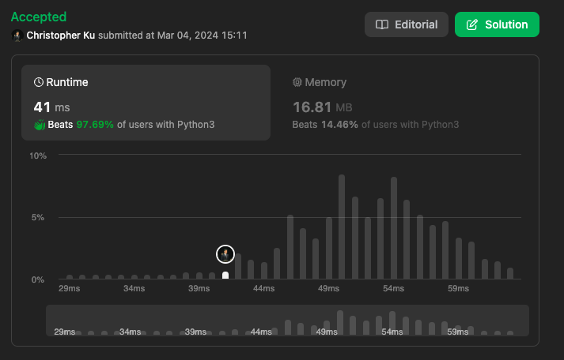

# 948. Bag of Tokens
***Topics***: *Two Pointers, Greedy, Array*  
***Difficulty***: <span style="color: #fac31d;">Medium</span>
<!-- green: #46c6c2, yellow: #fac31d, red: #f8615c-->
---
You start with an initial power of `power`, an initial score of `0`, and a bag of tokens given as an integer array `tokens`, where each `tokens[i]` donates the value of $token_i$.

Your goal is to **maximize** the total score by strategically playing these tokens. In one move, you can play an unplayed token in one of the two ways (but not both for the same token):  

- **Face-up:** If your current power is at least `tokens[i]`, you may play $token_i$, losing `tokens[i]` power and gaining `1` score.  
- **Face-down:** If your current score is at least `1`, you may play $token_i$, gaining `tokens[i]` power and losing `1` score.  

Return the **maximum** possible score you can achieve after playing **any** number of tokens.

---
**Example 1:**  
Input: `tokens = [100], power = 50`  
Output: `0`  
Explanation: 
Since your score is `0` initially, you cannot play the token face-down. You also cannot play it face-up since your power (`50`) is less than `tokens[0]` (`100`).

**Example 2:**  
Input: `tokens = [200,100], power = 150`  
Output: `1`  
Explanation:  Play $token_1$ (`100`) face-up, reducing your power to `50` and increasing your score to `1`.  
There is no need to play $token_0$, since you cannot play it face-up to add to your score. The maximum score achievable is `1`.

**Example 3:**  
Input: `tokens = [100,200,300,400], power = 200`  
Output: `2`  
Explanation:  Play the tokens in this order to get a score of `2`:
1. Play $token_0$ (`100`) face-up, reducing power to `100` and increasing score to `1`.
2. Play $token_3$ (`400`) face-down, increasing power to `500` and reducing score to `0`.
3. Play $token_1$ (`200`) face-up, reducing power to `300` and increasing score to `1`.
4. Play $token_2$ (`300`) face-up, reducing power to `0` and increasing score to `2`.  

The maximum score achievable is `2`.

---
## Intuition
At first I thought this question would be dynamic programming. However, if we take a closer look at the question we could play the tokens in any order. So this means that DP approach wouldn't work because we aren't able to have a coherent state transition as we could choose from any index of `tokens`. So this problem could be solved with ether recursion or a greedy approach. 

A greedy approach would yield a more optimal runtime and space complexity so we can solve this problem with that approach. 

With a greedy approach we could first start off by sorting the `tokens` array. This is because we want to maximize score by playing `tokens[l]` with low `power` and gaining `power` by `tokens[r]` with high `power` values. Afterwards we could use 2 pointers to iterate through the `tokens` array and maximize our end `score` with the following conditions.

Notice that we never want to have both 0 score and 0 `power` this is because in that scenario we wouldn't be able to gain score by playing Face-up or gain power by playing Face-down.

The only way for use to gain score is to gain enough `power` so we could make returns from lower `tokens[l]`. So in this case if our `curr_score` is less than 1 we would always want to gain score by playing `token[l]` Face-up if `power >= token[l]`. However if we both our `power` and score are at 0 this means that we have reached the end state as we aren't able to progress any further as our `power` is lower than the lowest possible `token[l]`.

However, if our score is more than or equal to one we want to maximize score as much as possible. This means that if our power is is more than `tokens[l]` we would want to play it Face-up and gain `1` score. However if our `power` is less than `tokens[l]`, we would want to gain the most amount of `power` possible so we could maximize the amount of score we could gain later. In this case we would play `tokens[r]` Face-down and loose `1` score.

Depending on which is played `tokens[l]` or `tokens[r]`, we would increment `l` or decrement `r` until all elements are processed and return the max `ans` (score) possible.

---
## Implementation
We would use a while loop for the 2 pointer approach as described above. At the end of each iteration we would make a note of the current score with `ans = max(ans, curr_score)` to update the maximal score recorded if needed. 

**Extremes and Edge Cases:**
- As discussed before the terminal state of the algorithm within the while loop would be at the point where we have no score to gain power, and also not enough power to gain score. This happens when `curr_score < 1 and power < tokens[l]`, in this case we would end the while loop there and return `ans`.

---
## Solution
```python
def bagOfTokensScore(self, tokens: List[int], power: int) -> int:
    tokens.sort()
    l, r = 0, len(tokens) - 1
    ans = 0
    curr_score = 0
    while l <= r:
        # If score is less than one then you have to gain score by playing face up
        if curr_score < 1:
            if power >= tokens[l]:
                power -= tokens[l]
                curr_score += 1
                l += 1
            else:
                return ans
        else:
            if power >= tokens[l]:
                power -= tokens[l]
                curr_score += 1
                l += 1
            else:
                power += tokens[r]
                curr_score -= 1
                r -= 1
        ans = max(ans, curr_score)
    return ans
```
---
## Runtime & Space Complexity
$N$ ~ being the size of input array `tokens`.  

Runtime Complexity:  
$\mathcal{O}(N \cdot log(N))$

Sorting the input array `tokens` will take in the worse case $\mathcal{O}(N \cdot log(N))$ runtime.

Space Complexity:  
$\mathcal{O}(N)$

Sorting use extra space and in Python it uses the TimeSort algorithm which takes a space of $\mathcal{O}(N)$.

---
## Code Performance


---